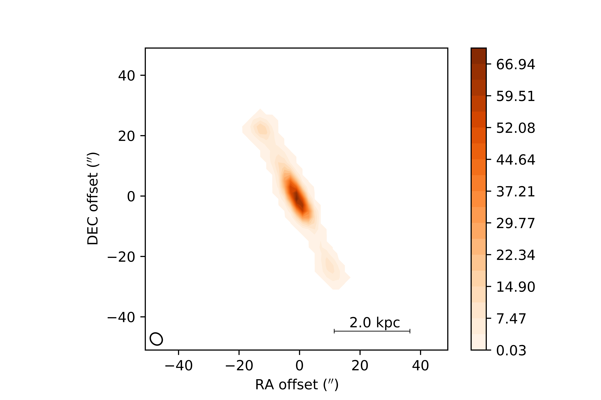

# CARS General Tutorial Data
All credit for Grant Tremblay for the [OG CARS tutorial](https://github.com/granttremblay/CARS_MUSE_Tour), I'm just trying to modify it to be more general, include ALMA data, and others.

The goal is to plot the moments and the PVD using python:
